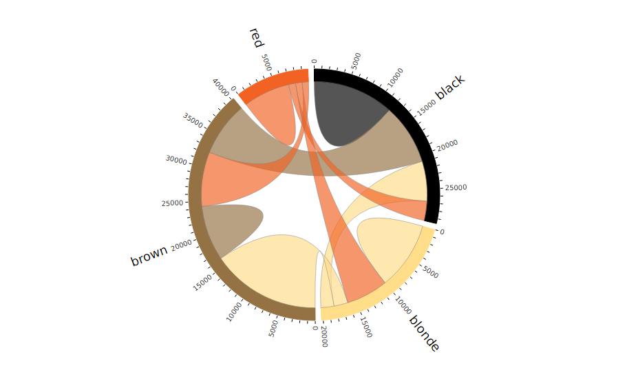

<!-- README.md is generated from README.Rmd. Please edit that file -->
Create a D3 Chord Diagram
=========================

The `chorddiag` package allows to create interactive chord diagrams using the JavaScript visualization library D3 (<http://d3js.org>). Chord diagrams show directed relationships among a group of entities. The chord diagram layout is explained in detail here: <https://github.com/mbostock/d3/wiki/Chord-Layout>.

To quote the explanation found there:

> Consider a hypothetical population of people with different hair colors: black, blonde, brown and red. Each person in this population has a preferred hair color for a dating partner; of the 29,630 (hypothetical) people with black hair, 40% (11,975) prefer partners with the same hair color. This preference is asymmetric: for example, only 10% of people with blonde hair prefer black hair, while 20% of people with black hair prefer blonde hair. A chord diagram visualizes these relationships by drawing quadratic Bézier curves between arcs. The source and target arcs represents two mirrored subsets of the total population, such as the number of people with black hair that prefer blonde hair, and the number of people with blonde hair that prefer black hair.

To create a chord diagram for this example, we need the preferences in matrix format:

``` r
m <- matrix(c(11975,  5871, 8916, 2868,
              1951, 10048, 2060, 6171,
              8010, 16145, 8090, 8045,
              1013,   990,  940, 6907),
            byrow = TRUE,
            nrow = 4, ncol = 4)
groupNames <- c("black", "blonde", "brown", "red")

row.names(m) <- groupNames
colnames(m) <- groupNames
m
#>        black blonde brown  red
#> black  11975   5871  8916 2868
#> blonde  1951  10048  2060 6171
#> brown   8010  16145  8090 8045
#> red     1013    990   940 6907
```

Then, the `chorddiag` function creates the chord diagram:

``` r
library(chorddiag)
groupColors <- c("#000000", "#FFDD89", "#957244", "#F26223")
chorddiag(m, groupColors = groupColors, groupnamePadding = 20)
```



This diagram will be interactive when generated by the function. The package's code is based on <http://bl.ocks.org/mbostock/4062006>.

Updating to the latest version of chorddiag
-------------------------------------------

You can track (and contribute to) development of `chorddiag` at <https://github.com/mattflor/chorddiag>. To install it, run the following command (this requires the `devtools` package):

``` r
devtools::install_github("mattflor/chorddiag")
```
